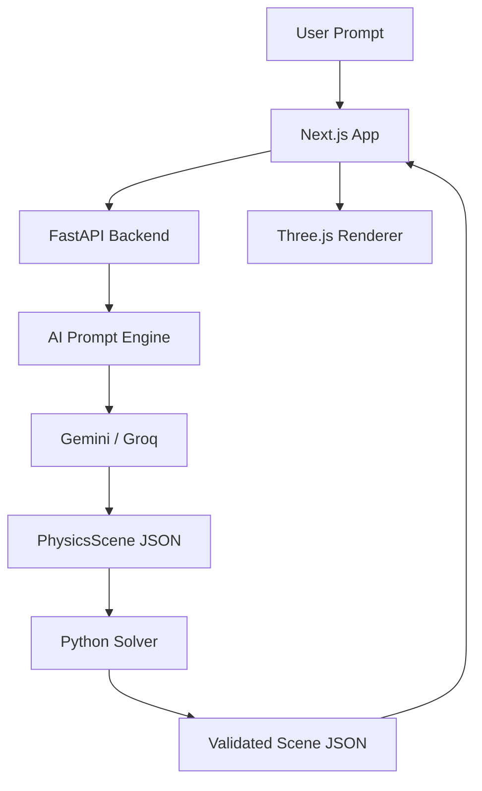

# Architecture & Data Flow

## System Architecture

`physica` is built with a decoupled architecture that separates the "Brain" (LLM), the "Solver" (Python Physics), and the "Canvas" (Three.js).

## Key Components

### 1. Backend (`core/`)
- **`main.py`**: The entry point. Handles session management and REST endpoints.
- **`prompt_engine.py`**: Orchestrates calls to Gemini/Groq. It uses a strictly typed `PhysicsScene` schema to ensure the LLM output is structured.
- **`physics_solver.py`**: A deterministic library that takes a "physics intent" (e.g., "projectile") and computes the exact `[x, y, z]` path coordinates.
- **`schema.py`**: Pydantic models that define exactly what a Chapter, Object, and Scene look like.

### 2. Frontend (`frontend/`)
- **`SceneViewer.tsx`**: The Three.js implementation. It maps the JSON `path` data to 3D animations.
- **`TeacherPanel.tsx`**: Manages the conversation history and the "AI Teacher" persona interaction.
- **`PromptScreen.tsx`**: The landing page for inputting problems and uploading reference images.

## Data Lifecycle

1.  **Request**: User enters a prompt + optional image.
2.  **Scene Gen**: `PromptEngine` asks the LLM to plan a 4-chapter story and define the objects.
3.  **Solving**: For any object with a `physics_intent`, the `PhysicsSolver` calculates its trajectory over the chapter's `duration_hint`.
4.  **Validation**: The backend ensures all IDs are unique and all coordinates are within the "View Box".
5.  **Rendering**: The frontend receives the full JSON and animates the objects chapter by chapter.
6.  **Interaction**: During a chapter, the student can ask questions. The teacher uses `generate_narration` (with a screenshot of the current frame) to respond accurately.
